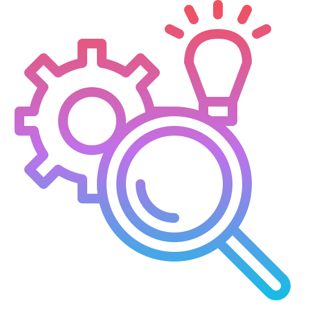

<h3>
  
  Soft skills:
</h3>

- [Что такое SDLC?](https://youtu.be/nTE4qvSvxXY?t=49)
- [Что такое Agile?](https://youtu.be/nTE4qvSvxXY?t=135)
- [Что такое код ревью? Почему оно важно?](https://youtu.be/nTE4qvSvxXY?t=217)
- [Что такое CI/CD?](https://youtu.be/nTE4qvSvxXY?t=307)
- [Плюсы CI/CD?](https://youtu.be/nTE4qvSvxXY?t=376)
- [Что такое технический долг?](https://youtu.be/nTE4qvSvxXY?t=440)
- [Что такое функциональные и нефункциональные требования?](https://youtu.be/nTE4qvSvxXY?t=526)
- [Разница между POC, Prototype и MVP?](https://youtu.be/nTE4qvSvxXY?t=607)
- [Разница между DoD и DoR?](https://youtu.be/DZjIcc6KdjE?t=625)
- [Почему критерии DoD и DoR важны для проекта?](https://youtu.be/DZjIcc6KdjE?t=709)
- [Кто такой стейкхолдер (stakeholder)? Расскажите о матрице RACI?](https://youtu.be/DZjIcc6KdjE?t=767)
- [Разница между менторингом и коучингом?](https://youtu.be/DZjIcc6KdjE?t=857)
- [Опишите суть методологии GitFlow?](https://youtu.be/hJDqYohmzL8?t=811)
- [Какие паттерны разработки вы бы рекомендовали для улучшения масштабируемости веб-приложений?](https://youtu.be/NxPUaFAIyL0?t=645)
- [Какие подходы к оформлению кода и документированию вы считаете лучшими для JavaScript проектов?](https://youtu.be/NxPUaFAIyL0?t=751)
